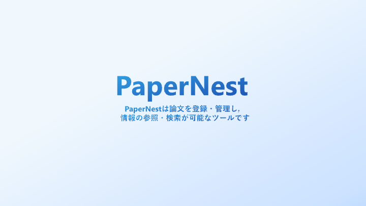
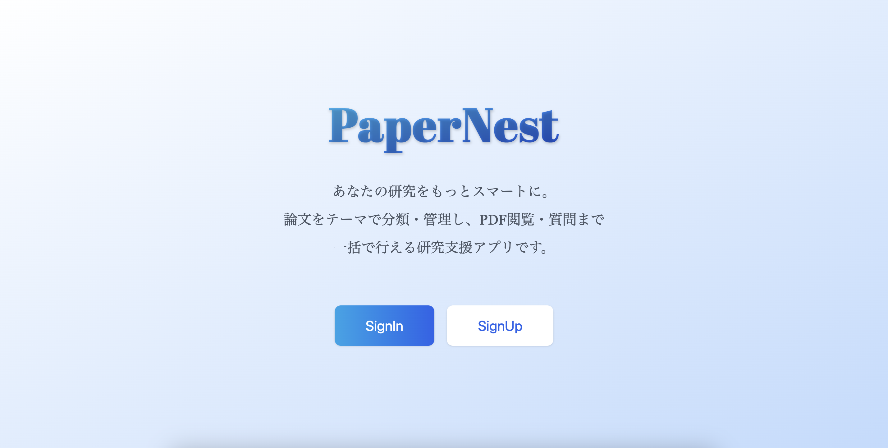
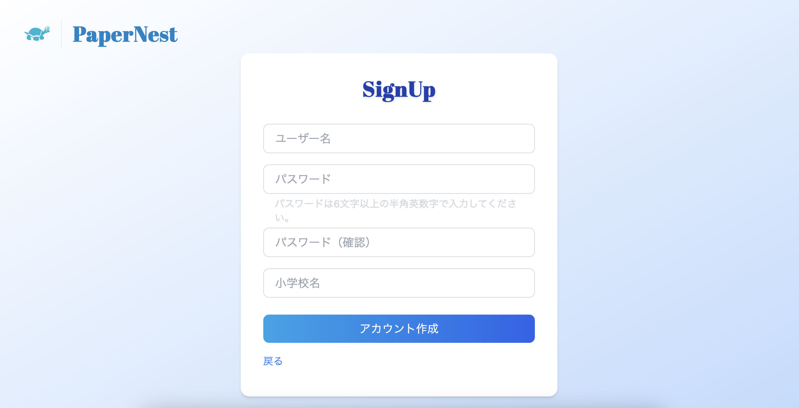
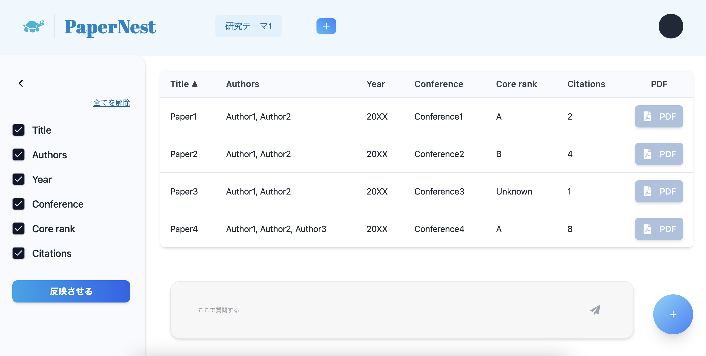
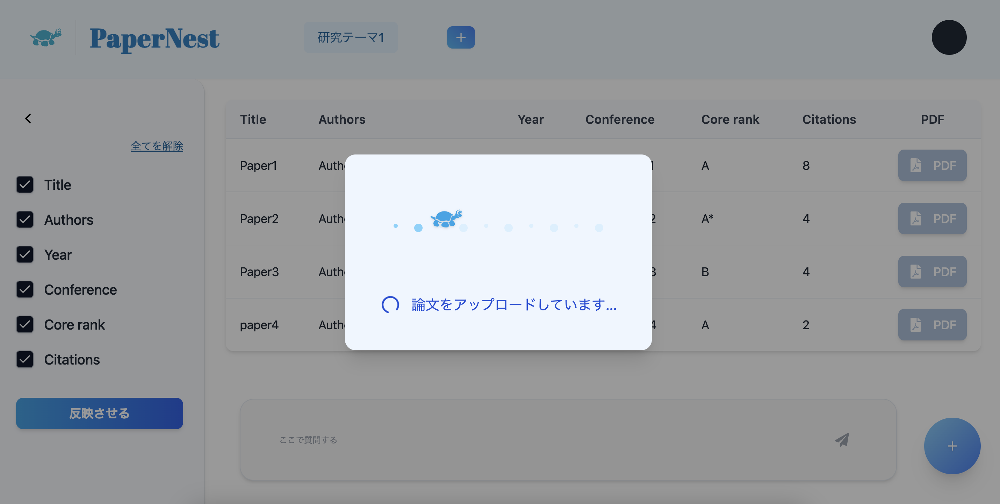
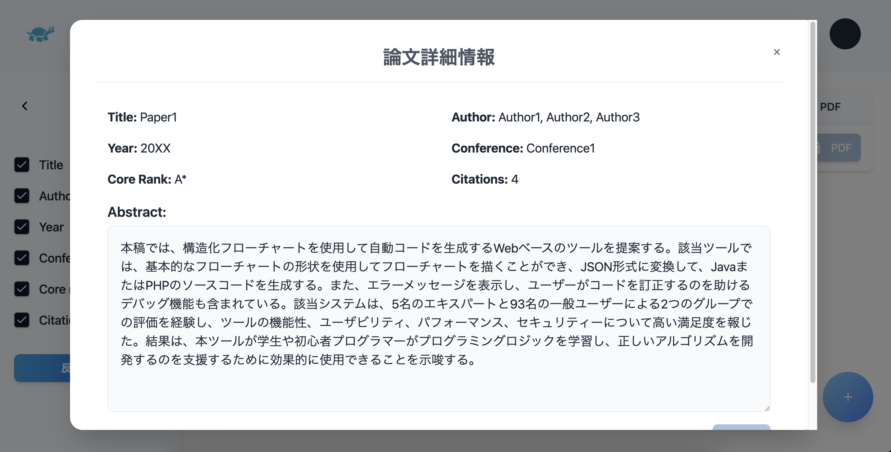
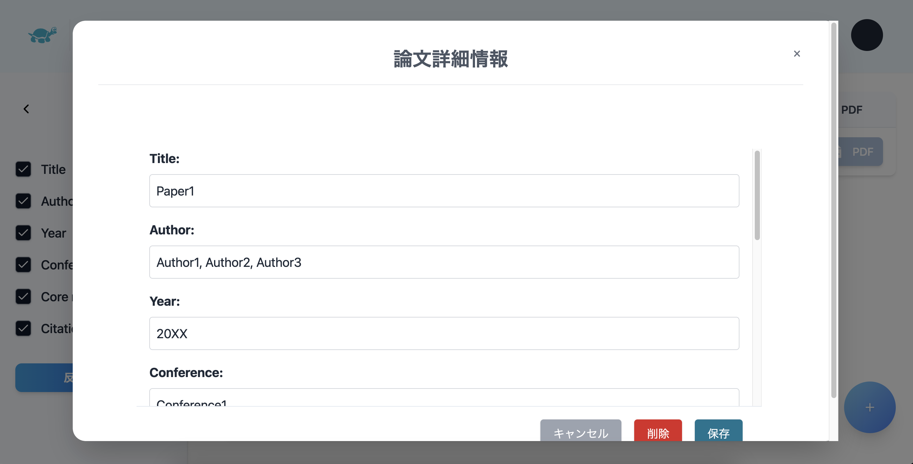
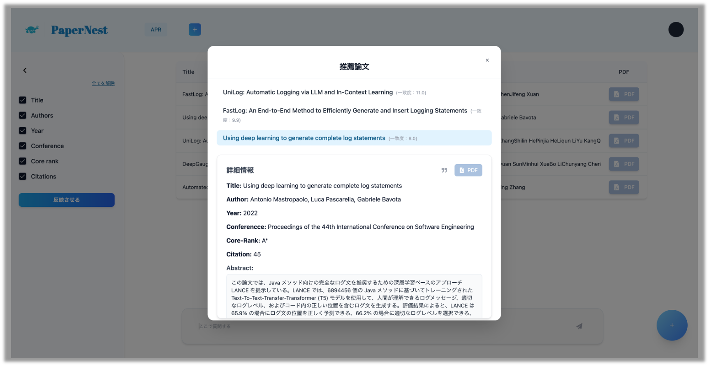
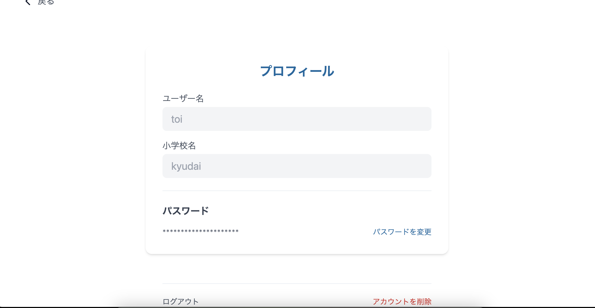

## 使用方法
現在，当研究室内のサーバー・ネットワークでの使用のみを想定していますが，ローカルで使うことも可能です．
<br>

<details>
<summary><strong>ローカルで使う手順</strong></summary>

## Docker によるセットアップ手順 (frontend + backend)

### 1. リポジトリのクローン

```bash
git clone https://github.com/posl/PaperNest.git
```

### 2. .env の作成

.devcontainer/Docker/backend に.env ファイルを作成\\
Groq の API キーを使用します（無料で使用可能！）．

.env ファイルの形式

```bash
GROQ_API_KEY=your_api_key
SECRET_KEY=hoge
ALGORITHM=fuga
ACCESS_TOKEN_EXPIRE_MINUTES=hogehoge
REFRESH_TOKEN_EXPIRE_DAYS=fugafuga
```

### 3. コンテナの作成，機動

```bach 
cd .devcontainer
docker compose build --no-cache
docker compose up
```

### 4. Web にアクセス

backend -> http://localhost:8000/
frontend -> http://localhost:3000/
Swagger API -> http://localhost:8000/docs

</details>

## 開発のきっかけ

我々の研究室内で、過去に見た論文を探したり、まとめるのが面倒だという声がありました。そのような意見を受けて、論文 PDF を登録し、必要な情報を参照したり、条件に合う論文をリストアップするアプリを開発しようと思いました。

## 使用技術

| Category        | Technology Stack                                                                                 |
| --------------- | ------------------------------------------------------------------------------------------------ |
| Frontend        | React                                                                                            |
| Backend         | FastAPI                                                                                          |
| Infrastructure  | Docker                                                                                           |
| Database        | sqlite                                                                                           |
| Vector Databese | FAISS(LangChain)                                                                                 |
| LLM             | Groq(llama3-70b-8192), Hugging Face(sentence-transformers/paraphrase-multilingual-MiniLM-L12-v2) |
| etc.            | Git, GitHub                                                                                      |

## 機能一覧

| トップ画面                                                 | 新規登録画面                                         |
| ------------------------------------------------------------ | ---------------------------------------------------- |
|                      |              |
| ログイン画面，新規登録画面に遷移できます． |ユーザー名，パスワード，学校名を入力することで，登録できます．

| 登録論文一覧画面                                                                                                                         | 論文登録機能                                                           |
| ---------------------------------------------------------------------------------------------------------------------------------------- | ---------------------------------------------------------------------- |
|                                                                                           |                                |
| ログイン後の基本画面です．論文の情報を参照したり，情報でフィルタリングできます．右上のボタンから設定画面への遷移やログアウトが可能です． | 右下の+ボタンを押し，PDFを選択することで，論文をアップロードできます． |

| 論文情報確認画面                                           | 論文情報編集画面                                       |
| ---------------------------------------------------------- | ------------------------------------------------------ |
|  |  |
| タイトルや著者，要約などを確認できます．                   | 登録した論文情報を編集できます                         |

| 類似論文検索機能                                       | 設定画面                                                     |
| ------------------------------------------------------ | ------------------------------------------------------------ |
|            |                         |
| 事業者情報と備考欄情報のマスタ登録機能を実装しました。 | アカウント情報の編集や，アカウント削除を行うことができます． |

<!-- ## 工夫した点

### フロントエンド

- 論文登録時の待機画面を実装
- タイトルや Author など，細かい情報をチェックボックスでフィルタリング

### バックエンド

- 論文登録時に，複数の API で論文情報を検索
- ベクトル検索の精度を向上させるため，HyDE を採用
- 類似論文検索時に，質問文が英語以外の言語で記述されている場合，英語に翻訳
- ベクトルデータベースに metadata 属性としてユニークな情報を設定 -->

## 今後の課題・追加機能

- 1つ1つの論文へのチャットによる質問機能
- 類似論文検索で，取得件数を安定させる
- デプロイ時に発生した各エラーへの対処
